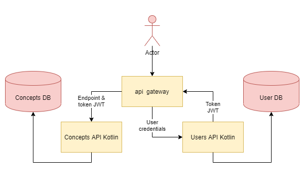

# Api GateWay & Api Res Kotlin
_Api Gateway generator for user consulting with a given token for a JWT query._

## Content
* **java-gateway** - Folder containing API gateway files.
* **kotlin-concepts-service-api** - Folder containing Concepts Services files.
* **kotlin-users-service-api** - Folder containing User Services files.
* **manual_tests** - Folder containing python test files and a json output file.
* **Arquitectura_Proyecto.png** - Project Architecture Diagram.

## Built with
* [Kotlin](https://kotlinlang.org/) - For programing and testing our software.
* [Python 3.6](https://www.python.org/downloads/) - For programing and testing our software.
* [Java](https://www.java.com/es/download/) - For programming our software.

## Credits
Final proyect for the subject "Web Services Development" at Pontificia Universidad Javeriana Cali, Colombia, 2020.

## Authors
* **Victor M. Ospina** - *Main Programming* - [VictorO98](https://github.com/VictorO98)
* **Diego F. Galarza** - *Main programming* - [diegogalarza](https://github.com/diegogalarza)
* **Tania C. Obando** - *Main programming* - [Taniaobando](https://github.com/Taniaobando)
